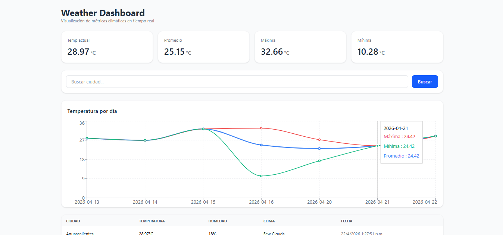
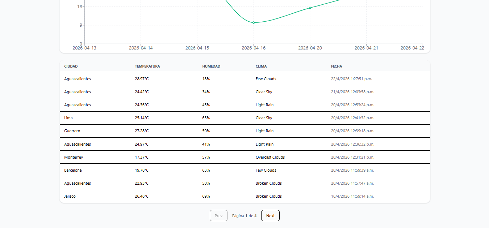

# 🌦️ Weather Data Dashboard

Full-stack application to fetch, process, store, and visualize weather data by city.

This project demonstrates backend development with FastAPI, database integration with PostgreSQL, and a modern frontend built with React and TailwindCSS.

---

## 🚀 Features

- 🔎 Search weather data by city
- 📊 KPI metrics (current, average, min, max temperature)
- 📈 Historical temperature charts
- 📋 Paginated data table
- 🗄️ Data persistence using PostgreSQL
- 🌐 Custom API built on top of a public weather API

---

## 🛠️ Tech Stack

### Backend

- FastAPI
- PostgreSQL
- SQLAlchemy

### Frontend

- React (Vite)
- TailwindCSS
- Recharts

---

## 📂 Project Structure

```
backend/   → API, services, database models
frontend/  → React UI and components
```

---

## ⚙️ Setup

### 1. Clone repository

```bash
git clone <your-repo-url>
cd <your-repo>
```

---

### 2. Backend setup

```bash
cd backend
pip install -r requirements.txt
```

Create `.env` file:

```
DATABASE_URL=your_database_url
API_KEY=your_weather_api_key
```

Run server:

```bash
uvicorn app.main:app --reload
```

---

### 3. Frontend setup

```bash
cd frontend
npm install
npm run dev
```

---

## 📸 Preview




---

## 🎯 Purpose

This project was built as part of my portfolio to demonstrate:

- Full-stack development
- API design and consumption
- State management and UI structuring
- Data visualization

---

## 📌 Future Improvements

- Dark mode
- Better mobile UX
- Deployment (Docker + cloud)
- Authentication system

---
